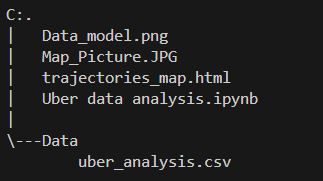
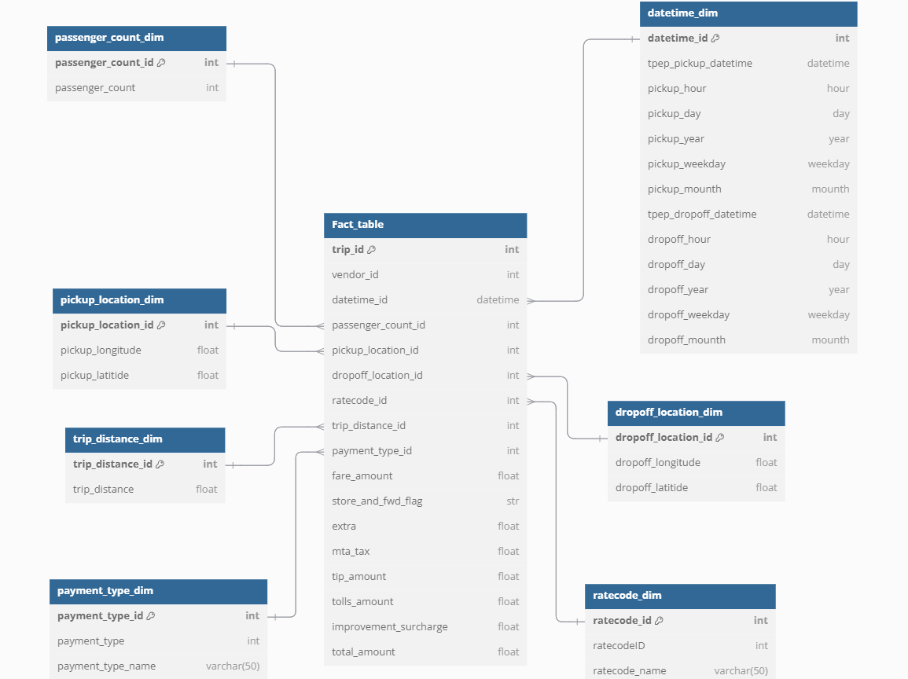
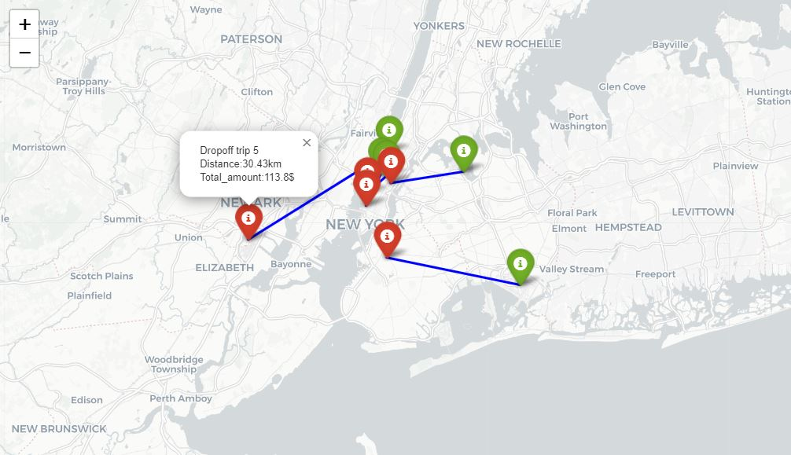

# Uber Data Analysis Project 🚖
## 🚀 Overview
Welcome to the Uber Data Analysis Project!🚖📊 This project aims to provide insights into Uber's ride-sharing data using a dimensional modeling approach, specifically leveraging fact tables and dimension tables.
## Project structure 

### Advantages of Dimensional Modeling

Transforming the data into fact and dimension tables offers several key advantages:

-`Data Organization📂`: Fact tables capture quantitative data (like total amount,extra...) while dimension tables provide contextual information (like datetime, locations, and passenger details). This separation simplifies data management and enhances clarity.

-`Improved Query Performance⚡`: By structuring the data in this way, we can perform complex queries more efficiently. This results in faster retrieval of insights and analysis.

-`Scalability📈`: The dimensional model allows for easy expansion. New dimensions can be added without disrupting existing data structures, making it adaptable to changing business needs.

-`Enhanced Analytical Capabilities🔍`: This approach facilitates advanced analytics, enabling us to slice and dice the data easily and uncover deeper insights about ride-sharing patterns.

## 📊 Project Features
-`Data Manipulation:📊` Leveraged fact tables to record ride details (like trip distance, fare amount, etc.) and dimension tables for contextual data (like datetime, locations, and passenger information).

-`Interactive Visualization:🗺️` Created a comprehensive map visualizing each trip, showcasing distance traveled and total fare.

## 🔧 Technologies Used
-`Programming Language💻:` Python

-`Data Processing:🔗` Pandas

-`Visualization:🗺️` Folium,plotly.express

`Tools:⚙️` Jupyter Notebook,dbdiagram.io

# 🗺️  Visualisation 

